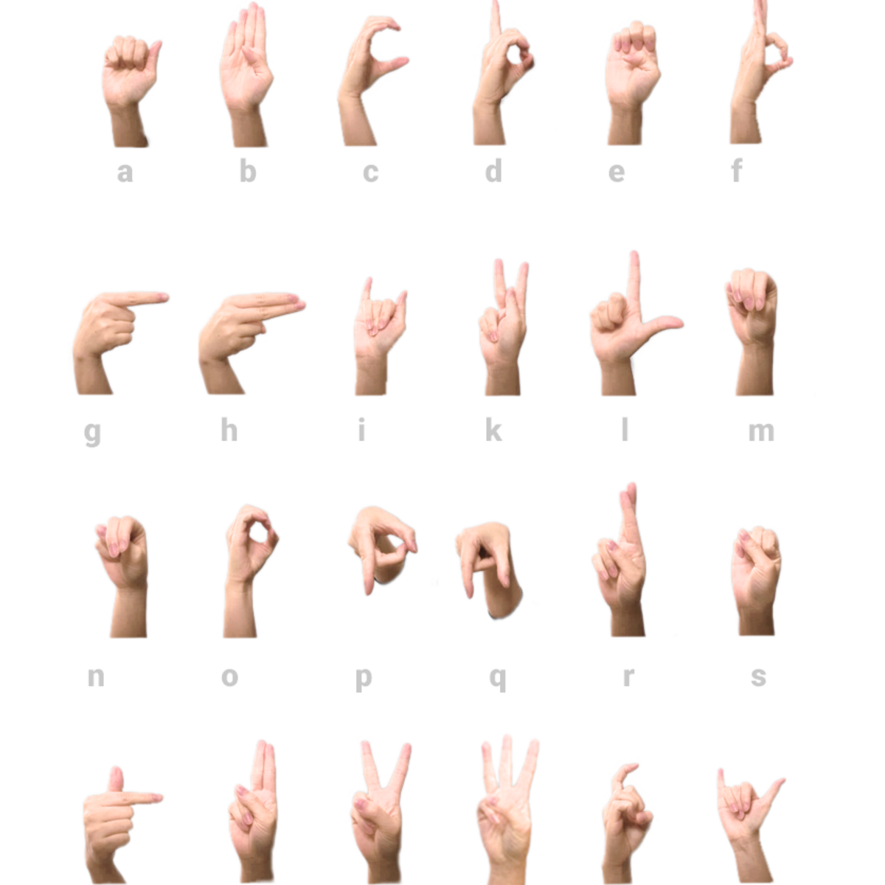
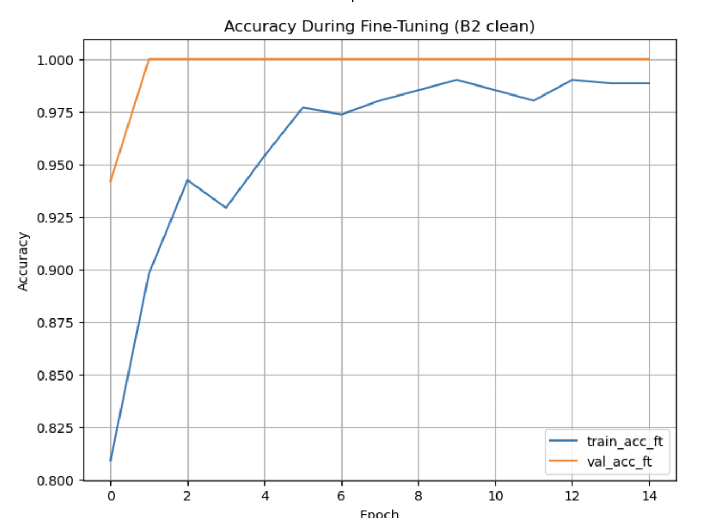
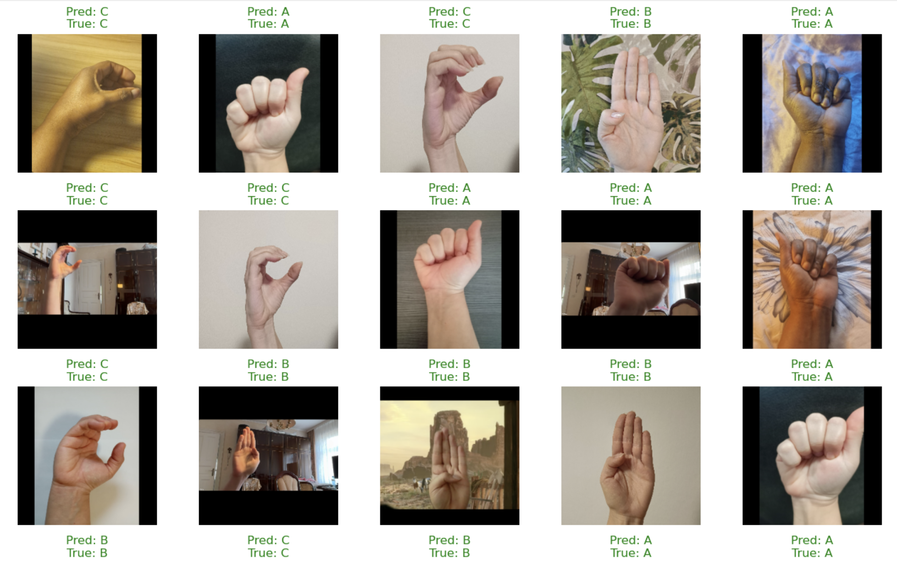

# 🤟 Sign Language ABC Classification  

## Deep Learning Project — WBS Coding School  
This project uses **Convolutional Neural Networks (CNNs)** and **transfer learning** to classify hand signs for the letters **A**, **B**, and **C** in German Sign Language (DGS).  
Using EfficientNet and careful data preparation, the final model reached **91.92% accuracy** on the hidden competition test set.

---

## 🎯 Objective  
The goal of this project is to train a model that can correctly identify the letters **A**, **B**, and **C** from images of hand signs.

> 🧠 *Teaching a neural network to learn its ABCs — one hand sign at a time.*

---

## 🖼️ Dataset Preview  



---

## 📂 Repository Contents  
- 📓 **notebooks/B2_TheWinnerModel.ipynb** — ⭐ final winning notebook (EfficientNetB2)  
- 📓 notebooks/ — other experiment notebooks:
  - CNN baseline  
  - Image augmentation  
  - L2 regularisation  
  - Transfer learning experiments (B0, B1, B2)  
- 🤖 **Final model (sign_efficientnetB2_clean_competition.keras)** — available via Google Drive (see “Download the Trained Model” below)
- 🤖 **Legacy models (stored in `models/`):**
  - `sign_efficientnet_competition.keras`
  - `sign_efficientnetB2_competition.keras`  
  *(earlier competition models, superseded by the clean B2 model on Google Drive)*
- 📂 images/ — project visuals:
  - dataset-card-1.png — dataset preview  
  - accuracy.png — fine-tuning accuracy curve  
  - confusion_matrix.png — validation confusion matrix  
  - predictions.png — sample prediction grid  
- 📄 README.md — project documentation  
- 📄 .gitignore
  
---

## 📥 Download the Trained Model  

Because of GitHub file size limits, the final competition-winning model  
`sign_efficientnetB2_clean_competition.keras` is hosted on Google Drive:

👉 [Download the final EfficientNetB2 model](https://drive.google.com/file/d/14-rianFv4c1xhsWUCpd8InXstBCEkDsU/view?usp=drive_link)

You can load it in Keras like this:

```python
import tensorflow as tf

model = tf.keras.models.load_model("sign_efficientnetB2_clean_competition.keras")
---

## 🧑‍💻 Approach  

### 1️⃣ Data Collection  
- Collected custom hand-sign photos for **A**, **B**, and **C**  
- Captured images with varied:
  - lighting  
  - backgrounds  
  - camera angles  
  - distances  

### 2️⃣ Data Preparation  
- Organised raw images into class folders  
- Split into **train** and **validation** sets  
- Applied **real-time image augmentation** using Keras:
  - RandomFlip  
  - RandomRotation  
  - RandomZoom  
  - RandomContrast  

### 3️⃣ Model Development  
- Started with baseline CNN models  
- Introduced:
  - **Dropout**  
  - **L2 regularisation**  
  - Batch Normalisation  
- Performed transfer learning with:
  - **EfficientNetB0**  
  - **EfficientNetB1**  
  - **EfficientNetB2** (winner)

### 4️⃣ Final Model — EfficientNetB2  
- Two-stage training:
  1. Train classifier head  
  2. Unfreeze backbone for fine-tuning  
- Used callbacks:
  - ReduceLROnPlateau  
  - EarlyStopping  
  - ModelCheckpoint  
- Achieved competition-winning accuracy.

---

## 🎧 Results  

### 🏆 Final Performance  
- **Competition accuracy:** 91.92%  
- **Validation accuracy:** 100%  
- **Best model:** `sign_efficientnetB2_clean_competition.keras`

### Classification Report (Validation Set)

| Class | Precision | Recall | F1-Score |
|------|-----------|--------|----------|
| A | 1.00 | 1.00 | 1.00 |
| B | 1.00 | 1.00 | 1.00 |
| C | 1.00 | 1.00 | 1.00 |

> 🚀 The EfficientNetB2 model generalised best and became the winner of the internal competition.

---

## 📈 Model Performance (EfficientNetB2 Clean — Winner Model)

### 🔥 Final Fine-Tuning Accuracy Curve  


This plot shows the accuracy during the fine-tuning phase of **EfficientNetB2 Clean**, where the model quickly stabilizes above **97%** and validation accuracy reaches **100%**.

---

### 🟪 Confusion Matrix — Perfect Classification  


| Class | Correct | Misclassified |
|:-----|--------:|--------------:|
| **A** | 24 | 0 |
| **B** | 23 | 0 |
| **C** | 22 | 0 |

The model achieved **100% accuracy** on the validation/test split used for the competition.

---

## 🖼️ Example Predictions  
Below are some random test images with their predicted and true labels.  
The model correctly identifies all A, B, and C signs across different backgrounds, skin tones, angles, and lighting:



---

## 🛠 Tools Used  
1. **Python** — TensorFlow, Keras, NumPy  
2. **EfficientNetB2** — transfer learning backbone  
3. **Matplotlib** — visualisations  
4. **Jupyter Notebooks** — experimentation  

---

## 🎓 Key Learnings  
1. Image quality & dataset diversity strongly influence performance  
2. Transfer learning significantly boosts model accuracy  
3. Data augmentation prevents overfitting  
4. Fine-tuning only the top layers is not enough — full-network fine-tuning matters  
5. Proper callbacks stabilise and optimise training  

---

## 💡 Final Summary  
✅ Built a complete sign-language image classifier  
✅ Achieved **91.92%** accuracy on the test set  
✅ EfficientNetB2 proved the best feature extractor  
✅ Demonstrated full deep-learning workflow:  
*data → augmentation → CNN → transfer learning → fine-tuning → evaluation*

> 🤟 *A small project with a simple goal: help a model learn its ABCs.*  
